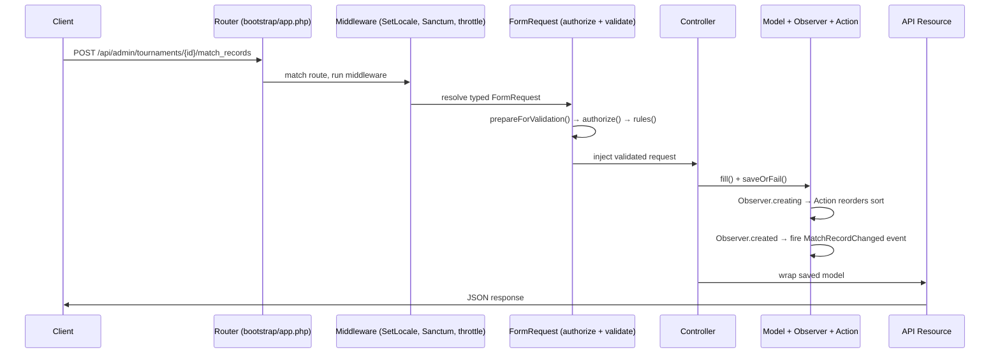

# 04 — Request Lifecycle

> See also: [05 — Controllers & Requests](05-controllers-and-requests.md), [07 — Persistence & Model Lifecycle](07-persistence-and-lifecycle.md), [10 — Notable Patterns](10-notable-patterns.md)

This chapter follows one HTTP request from the wire to the JSON response, naming every stage and the
file responsible for it. Nearly every endpoint in the app follows this exact path — learn it once and
the rest is repetition.

## The pipeline



## Stage by stage

### 1. Routing

`bootstrap/app.php` mounts the two route files under `/api/admin` and `/api/public`. The router
matches the URL and HTTP verb to a controller method. Route-model binding (≈ automatic lookup) turns a
URL segment like `{tournament}` into a loaded `Tournament` model before the controller runs — and for
the public athlete route, `{athlete:tax_number}` binds by the `tax_number` column instead of the id.

### 2. Middleware

Middleware are filters that wrap the request (≈ Express middleware / servlet filters). For the API
group, `SetLocale` runs first (prepended in `bootstrap/app.php`):

```php
// app/Http/Middleware/SetLocale.php, lines 22-27
private function resolveLocale(Request $request): string
{
    $preferred = $request->getPreferredLanguage(self::SUPPORTED_LOCALES);
    return $preferred ?? config('app.locale');
}
```

It reads the `Accept-Language` header, picks `en` or `it`, and sets the app locale so any `__()`
translation call later (e.g. enum labels, error messages) responds in the right language.

Then, depending on the surface:
- **admin** routes inside the `auth:sanctum` group require a valid bearer token;
- **public** routes carry `throttle:10,1` (10 requests/minute).

### 3. FormRequest — authorize then validate

Laravel sees a controller method type-hinted with, say, `MatchRecordStoreRequest` and automatically
constructs it, running three things in order *before* the controller body executes:

1. `prepareForValidation()` — mutate/normalise input. Here it parses the `?with=` param into an array
   and injects `tournament_id` from the route:
   ```php
   // app/Http/Requests/MatchRecord/MatchRecordStoreRequest.php, lines 50-57
   protected function prepareForValidation(): void
   {
       $this->injectWithPrepare();
       $this->merge([
           'tournament_id' => $this->input('tournament_id', $this->tournament?->id),
       ]);
   }
   ```
2. `authorize()` — a boolean gate. Across this app it is `return auth()->hasUser();` for admin
   requests (must be logged in) and `true` for public ones.
3. `rules()` — the validation rules. If validation fails, Laravel short-circuits with a `422` JSON
   error and the controller never runs.

See [Chapter 05](05-controllers-and-requests.md) for the full FormRequest convention.

### 4. Controller

The controller receives the already-validated request and orchestrates the work. It is deliberately
thin — read `$request->validated()`, touch the model, return a Resource:

```php
// app/Http/Controllers/Api/TournamentMatchRecordController.php, lines 40-48
public function store(MatchRecordStoreRequest $request, Tournament $tournament): MatchRecordResource
{
    $validated = $request->validated();

    $matchRecord = new MatchRecord;
    $matchRecord->fill($validated)->saveOrFail();

    return new MatchRecordResource($matchRecord->loadMissing($validated['with'] ?? []));
}
```

`saveOrFail()` throws if the insert fails (rather than returning `false`), guaranteeing a clean error
path.

### 5. Model, Observer & Action

Calling `save()` triggers the model's **observer** (see [Chapter 07](07-persistence-and-lifecycle.md)).
For a match record:
- `creating` → `ReorderMatchRecordsAction::handleCreating()` assigns/normalises the `sort` index inside
  a DB transaction;
- `created` → fires the `MatchRecordChanged` event, which broadcasts `{"refresh": true}` over
  WebSockets after the transaction commits.

This is where domain rules live — the controller stays ignorant of them.

### 6. API Resource → JSON

The controller returns an **API Resource**, which serialises the model to its JSON shape. Most
resources are thin today:

```php
// app/Http/Resources/MatchRecordResource.php, lines 10-17
public function toArray(Request $request): array
{
    $resourceArray = parent::toArray($request);
    //
    return $resourceArray;
}
```

`loadMissing($validated['with'] ?? [])` in the controller eager-loads any relations the client asked
for via `?with=`, so the Resource can include them without N+1 queries.

### 7. Error rendering

`bootstrap/app.php` forces JSON error responses for any `api/*` path:

```php
// bootstrap/app.php (withExceptions)
$exceptions->shouldRenderJsonWhen(fn (Request $request) => $request->is('api/*'));
```

So a validation failure, a `409` from a delete guard, or a `401` from Sanctum all come back as JSON,
never an HTML error page.
