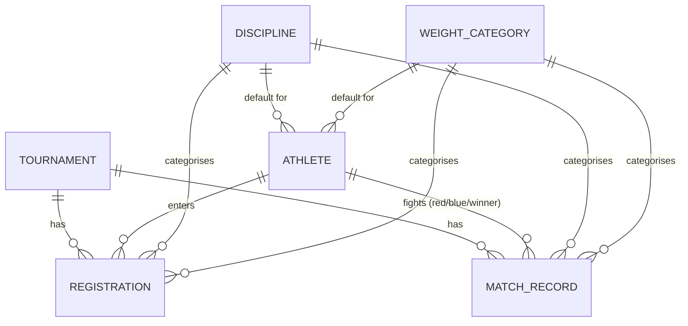

# 06 — Domain Models

> See also: [07 — Persistence & Model Lifecycle](07-persistence-and-lifecycle.md), [05 — Controllers & Requests](05-controllers-and-requests.md), [12 — Glossary](12-glossary.md)

This chapter describes the business entities, how they relate, and the enums that constrain their
state. If you are new to the *combat-sports* domain, read the conceptual notes carefully — the data
model mirrors how a real tournament is run.

## The domain in one paragraph

An organiser schedules a *tournament*. *Athletes* (each identified by a *tax number*) *register* for
it, picking a *discipline* (the combat style/ruleset) and a *weight category*. On fight day the
organiser builds the *fight card*: an ordered list of *match records* (bouts), each pairing a
red-corner athlete against a blue-corner athlete, recording rounds, judges' scores, how the bout ended,
and the winner.

## Entity-relationship diagram



## The entities

### Tournament

The top-level event. Has a name, location fields, a `date`, and a `status` enum. Owns many
`registrations` and many `matchRecords` (the latter always ordered by `sort`). Can have a single cover
image via Media Library.

```php
// app/Models/Tournament.php, lines 54-57
public function matchRecords(): HasMany
{
    return $this->hasMany(MatchRecord::class)->orderBy('sort');
}
```

Lifecycle is governed by `TournamentStatusEnum`:

| Value | Meaning |
|-------|---------|
| `scheduled` | Created, not yet open for entries. |
| `registrations_opened` | Athletes may self-register (the public form lists only these). |
| `registrations_closed` | Entry list frozen. |
| `in_progress` | Event running. |
| `completed` | Finished. |
| `cancelled` | Called off. |

### Athlete

A competitor. Has name fields, `birth_date`, a `gender` enum, a unique `tax_number` (the **public
lookup key** — `registration_form/athletes/{athlete:tax_number}`), and `team_name`. Carries *defaults*
— `default_discipline_id` and `default_weight_category_id` — to pre-fill the registration form.

An athlete participates in match records through **three distinct foreign keys**, so the model exposes
three relationships:

```php
// app/Models/Athlete.php, lines 60-73
public function redCornerMatches(): HasMany  { return $this->hasMany(MatchRecord::class, 'red_corner_id'); }
public function blueCornerMatches(): HasMany { return $this->hasMany(MatchRecord::class, 'blue_corner_id'); }
public function wonMatches(): HasMany        { return $this->hasMany(MatchRecord::class, 'winner_id'); }
```

It also has a useful `inTournament` scope that finds athletes registered in a given tournament
(optionally filtered by discipline/weight) via a subquery against `registrations`.

### Registration

The join entity (≈ a many-to-many link row carrying its own data) connecting an athlete to a
tournament, in a chosen discipline and weight category. Tracks operational state:

| Column | Meaning |
|--------|---------|
| `paid_at` | Timestamp the entry fee was paid (null = unpaid). |
| `arrived` | Boolean — athlete checked in on the day. |
| `weight_in` | The measured weigh-in figure (float). |
| `notes` | Free text. |

It has a domain guard against duplicates and three boolean scopes used for filtering the entry list:

```php
// app/Models/Registration.php, lines 78-87
public function isDuplicateRegistration(): bool
{
    return self::query()
        ->where('athlete_id', $this->athlete_id)
        ->where('tournament_id', $this->tournament_id)
        ->where('discipline_id', $this->discipline_id)
        ->where('weight_category_id', $this->weight_category_id)
        ->when($this->exists, fn ($q) => $q->whereNot('id', $this->id))
        ->exists();
}
```

The scopes `unpaid`, `unarrived`, and `weightInExceeded` answer the organiser's day-of questions
("who hasn't paid / arrived / made weight"). `weightInExceeded` compares the weigh-in against the
category limit with a correlated subquery.

### MatchRecord — the bout

The richest entity: a single fight on the card. Key columns:

| Group | Columns |
|-------|---------|
| Pairing | `red_corner_id`, `blue_corner_id`, `red_corner_team`, `blue_corner_team` |
| Classification | `weight_category_id`, `discipline_id`, `gender`, `forced` |
| Ordering | `sort` (contiguous position on the card; see [Chapter 07](07-persistence-and-lifecycle.md)) |
| Schedule | `scheduled_time`, `rounds`, `minutes_per_round` |
| Result | `winner_id`, `end_round`, `end_method`, `status`, `judges_points` (JSON) |

`judges_points` is cast to a PHP array (stored as JSON) — it holds per-round, per-judge scoring.
`status` uses `MatchRecordStatusEnum` (`scheduled`, `in_progress`, `completed`, `cancelled`) and
`end_method` uses `MatchRecordEndMethodEnum`:

| End method | Meaning |
|-----------|---------|
| `victory_unanimous_decision` / `victory_split_decision` | Win on the judges' scorecards. |
| `victory_ko` / `victory_tko` | Knockout / technical knockout. |
| `victory_disqualification` | Win because the opponent was disqualified. |
| `draw` | Tied. |
| `no_contest` | Bout voided. |

### Discipline & WeightCategory — reference data

Shared lookup tables, not owned by any single tournament. `Discipline` (e.g. a ruleset) carries default
`rounds` and `minutes_per_round`; `WeightCategory` carries a `label` and a numeric `value` (the weight
limit used by `Registration::weightInExceeded`). Both have many registrations, many match records, and
serve as the *default* discipline/weight for athletes.

### User

An organiser account. Extends Laravel's `Authenticatable`, uses Sanctum's `HasApiTokens`, has a
`superadmin` boolean, and hides `password`/`remember_token` from serialization. Password resets build a
link to the frontend (`app.frontend_url`).

## Enums are stored as strings

A project-wide invariant ([`CLAUDE.md`](../../CLAUDE.md)): every enum column is a plain `string` in the
database, cast to a backed PHP enum in the model (`'status' => TournamentStatusEnum::class`). There is
**no** DB-level `ENUM` type. Each enum also has a `label()` method returning a translated string via
`__('enums...')`, so the UI can show localised names. See [Chapter 07](07-persistence-and-lifecycle.md)
for how casts are declared.
