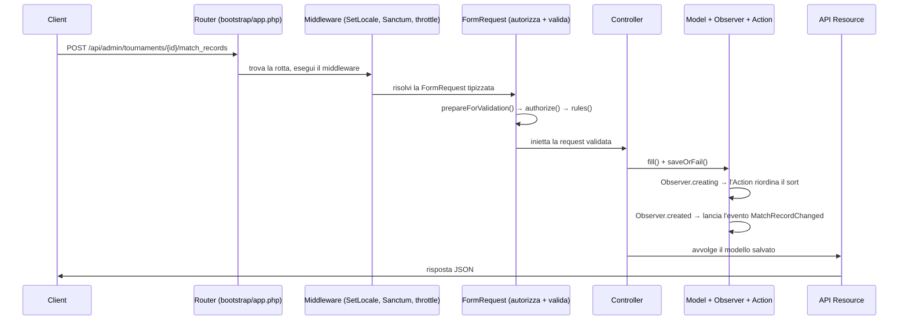

# 04 — Ciclo di Vita della Richiesta

> Vedi anche: [05 — Controller e Request](05-controllers-and-requests.md), [07 — Persistenza e Ciclo di Vita del Modello](07-persistence-and-lifecycle.md), [10 — Pattern Notevoli](10-notable-patterns.md)

Questo capitolo segue una richiesta HTTP dal filo alla risposta JSON, nominando ogni stadio e il file
che ne è responsabile. Quasi ogni endpoint dell'app segue esattamente questo percorso — imparalo una
volta e il resto è ripetizione.

## La pipeline



## Stadio per stadio

### 1. Routing

`bootstrap/app.php` monta i due file di rotte sotto `/api/admin` e `/api/public`. Il router abbina
l'URL e il verbo HTTP a un metodo del controller. Il route-model binding (≈ lookup automatico)
trasforma un segmento URL come `{tournament}` in un modello `Tournament` già caricato prima che il
controller giri — e per la rotta pubblica dell'atleta, `{athlete:tax_number}` fa il binding sulla
colonna `tax_number` invece che sull'id.

### 2. Middleware

I middleware sono filtri che avvolgono la richiesta (≈ middleware di Express / filtri servlet). Per il
gruppo API, `SetLocale` gira per primo (anteposto in `bootstrap/app.php`):

```php
// app/Http/Middleware/SetLocale.php, righe 22-27
private function resolveLocale(Request $request): string
{
    $preferred = $request->getPreferredLanguage(self::SUPPORTED_LOCALES);
    return $preferred ?? config('app.locale');
}
```

Legge l'header `Accept-Language`, sceglie `en` o `it` e imposta il locale dell'app, così che ogni
chiamata di traduzione `__()` successiva (es. label degli enum, messaggi di errore) risponda nella
lingua giusta.

Poi, a seconda della superficie:
- le rotte **admin** dentro il gruppo `auth:sanctum` richiedono un bearer token valido;
- le rotte **pubbliche** portano `throttle:10,1` (10 richieste/minuto).

### 3. FormRequest — prima autorizza, poi valida

Laravel vede un metodo del controller tipizzato con, ad esempio, `MatchRecordStoreRequest` e la
costruisce automaticamente, eseguendo tre cose in ordine *prima* che il corpo del controller esegua:

1. `prepareForValidation()` — muta/normalizza l'input. Qui analizza il param `?with=` in un array e
   inietta `tournament_id` dalla rotta:
   ```php
   // app/Http/Requests/MatchRecord/MatchRecordStoreRequest.php, righe 50-57
   protected function prepareForValidation(): void
   {
       $this->injectWithPrepare();
       $this->merge([
           'tournament_id' => $this->input('tournament_id', $this->tournament?->id),
       ]);
   }
   ```
2. `authorize()` — un gate booleano. In tutta l'app è `return auth()->hasUser();` per le request admin
   (deve essere loggato) e `true` per quelle pubbliche.
3. `rules()` — le regole di validazione. Se la validazione fallisce, Laravel interrompe con un errore
   JSON `422` e il controller non gira mai.

Vedi il [Capitolo 05](05-controllers-and-requests.md) per la convenzione completa delle FormRequest.

### 4. Controller

Il controller riceve la request già validata e orchestra il lavoro. È volutamente sottile — leggi
`$request->validated()`, tocca il modello, restituisci una Resource:

```php
// app/Http/Controllers/Api/TournamentMatchRecordController.php, righe 40-48
public function store(MatchRecordStoreRequest $request, Tournament $tournament): MatchRecordResource
{
    $validated = $request->validated();

    $matchRecord = new MatchRecord;
    $matchRecord->fill($validated)->saveOrFail();

    return new MatchRecordResource($matchRecord->loadMissing($validated['with'] ?? []));
}
```

`saveOrFail()` lancia un'eccezione se l'insert fallisce (invece di restituire `false`), garantendo un
percorso d'errore pulito.

### 5. Model, Observer & Action

Chiamare `save()` attiva l'**observer** del modello (vedi [Capitolo 07](07-persistence-and-lifecycle.md)).
Per un match record:
- `creating` → `ReorderMatchRecordsAction::handleCreating()` assegna/normalizza l'indice `sort` dentro
  una transazione DB;
- `created` → lancia l'evento `MatchRecordChanged`, che trasmette `{"refresh": true}` via WebSocket
  dopo il commit della transazione.

È qui che vivono le regole di dominio — il controller le ignora.

### 6. API Resource → JSON

Il controller restituisce una **API Resource**, che serializza il modello nella sua forma JSON. Oggi
la maggior parte delle resource sono sottili:

```php
// app/Http/Resources/MatchRecordResource.php, righe 10-17
public function toArray(Request $request): array
{
    $resourceArray = parent::toArray($request);
    //
    return $resourceArray;
}
```

`loadMissing($validated['with'] ?? [])` nel controller fa l'eager loading di tutte le relazioni
richieste dal client via `?with=`, così che la Resource possa includerle senza query N+1.

### 7. Rendering degli errori

`bootstrap/app.php` forza risposte di errore JSON per qualsiasi percorso `api/*`:

```php
// bootstrap/app.php (withExceptions)
$exceptions->shouldRenderJsonWhen(fn (Request $request) => $request->is('api/*'));
```

Quindi un fallimento di validazione, un `409` da una guardia di cancellazione o un `401` da Sanctum
tornano tutti come JSON, mai come una pagina di errore HTML.
