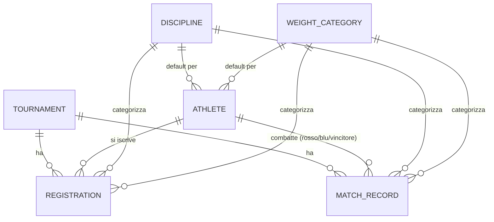

# 06 — Modelli di Dominio

> Vedi anche: [07 — Persistenza e Ciclo di Vita del Modello](07-persistence-and-lifecycle.md), [05 — Controller e Request](05-controllers-and-requests.md), [12 — Glossario](12-glossary.md)

Questo capitolo descrive le entità di business, come si relazionano e gli enum che vincolano il loro
stato. Se sei nuovo al dominio degli *sport da combattimento*, leggi con attenzione le note
concettuali — il modello dati rispecchia il modo in cui si svolge un torneo reale.

## Il dominio in un paragrafo

Un organizzatore programma un *torneo*. Gli *atleti* (ognuno identificato da un *codice fiscale*) si
*iscrivono*, scegliendo una *disciplina* (lo stile/regolamento di combattimento) e una *categoria di
peso*. Il giorno della gara l'organizzatore costruisce la *card degli incontri*: un elenco ordinato di
*match record* (incontri), ciascuno che abbina un atleta dell'angolo rosso a uno dell'angolo blu,
registrando round, punteggi dei giudici, come è finito l'incontro e il vincitore.

## Diagramma entità-relazioni



## Le entità

### Tournament (Torneo)

L'evento di primo livello. Ha un nome, campi di location, una `date` e un enum `status`. Possiede molte
`registrations` e molti `matchRecords` (questi ultimi sempre ordinati per `sort`). Può avere una singola
immagine di copertina tramite la Media Library.

```php
// app/Models/Tournament.php, righe 54-57
public function matchRecords(): HasMany
{
    return $this->hasMany(MatchRecord::class)->orderBy('sort');
}
```

Il ciclo di vita è governato da `TournamentStatusEnum`:

| Valore | Significato |
|--------|-------------|
| `scheduled` | Creato, non ancora aperto alle iscrizioni. |
| `registrations_opened` | Gli atleti possono auto-iscriversi (il form pubblico elenca solo questi). |
| `registrations_closed` | Elenco iscritti congelato. |
| `in_progress` | Evento in corso. |
| `completed` | Terminato. |
| `cancelled` | Annullato. |

### Athlete (Atleta)

Un competitore. Ha campi nome, `birth_date`, un enum `gender`, un `tax_number` univoco (la **chiave di
ricerca pubblica** — `registration_form/athletes/{athlete:tax_number}`) e `team_name`. Porta con sé dei
*default* — `default_discipline_id` e `default_weight_category_id` — per precompilare il form di
iscrizione.

Un atleta partecipa ai match record attraverso **tre chiavi esterne distinte**, quindi il modello
espone tre relazioni:

```php
// app/Models/Athlete.php, righe 60-73
public function redCornerMatches(): HasMany  { return $this->hasMany(MatchRecord::class, 'red_corner_id'); }
public function blueCornerMatches(): HasMany { return $this->hasMany(MatchRecord::class, 'blue_corner_id'); }
public function wonMatches(): HasMany        { return $this->hasMany(MatchRecord::class, 'winner_id'); }
```

Ha anche un utile scope `inTournament` che trova gli atleti iscritti a un dato torneo (filtrabile
opzionalmente per disciplina/peso) tramite una subquery su `registrations`.

### Registration (Iscrizione)

L'entità di join (≈ una riga di collegamento molti-a-molti che porta dati propri) che connette un atleta
a un torneo, in una disciplina e categoria di peso scelte. Traccia lo stato operativo:

| Colonna | Significato |
|---------|-------------|
| `paid_at` | Timestamp del pagamento quota (null = non pagato). |
| `arrived` | Booleano — l'atleta ha fatto check-in il giorno della gara. |
| `weight_in` | Il valore misurato al peso (float). |
| `notes` | Testo libero. |

Ha una guardia di dominio contro i duplicati e tre scope booleani usati per filtrare l'elenco iscritti:

```php
// app/Models/Registration.php, righe 78-87
public function isDuplicateRegistration(): bool
{
    return self::query()
        ->where('athlete_id', $this->athlete_id)
        ->where('tournament_id', $this->tournament_id)
        ->where('discipline_id', $this->discipline_id)
        ->where('weight_category_id', $this->weight_category_id)
        ->when($this->exists, fn ($q) => $q->whereNot('id', $this->id))
        ->exists();
}
```

Gli scope `unpaid`, `unarrived` e `weightInExceeded` rispondono alle domande dell'organizzatore il
giorno della gara ("chi non ha pagato / non è arrivato / non ha rispettato il peso"). `weightInExceeded`
confronta il peso misurato con il limite di categoria tramite una subquery correlata.

### MatchRecord — l'incontro

L'entità più ricca: un singolo combattimento sulla card. Colonne chiave:

| Gruppo | Colonne |
|--------|---------|
| Abbinamento | `red_corner_id`, `blue_corner_id`, `red_corner_team`, `blue_corner_team` |
| Classificazione | `weight_category_id`, `discipline_id`, `gender`, `forced` |
| Ordinamento | `sort` (posizione contigua sulla card; vedi [Capitolo 07](07-persistence-and-lifecycle.md)) |
| Programmazione | `scheduled_time`, `rounds`, `minutes_per_round` |
| Risultato | `winner_id`, `end_round`, `end_method`, `status`, `judges_points` (JSON) |

`judges_points` è castato a un array PHP (memorizzato come JSON) — contiene il punteggio per round e per
giudice. `status` usa `MatchRecordStatusEnum` (`scheduled`, `in_progress`, `completed`, `cancelled`) e
`end_method` usa `MatchRecordEndMethodEnum`:

| Metodo di conclusione | Significato |
|-----------------------|-------------|
| `victory_unanimous_decision` / `victory_split_decision` | Vittoria ai cartellini dei giudici. |
| `victory_ko` / `victory_tko` | Knockout / knockout tecnico. |
| `victory_disqualification` | Vittoria per squalifica dell'avversario. |
| `draw` | Pareggio. |
| `no_contest` | Incontro annullato. |

### Discipline & WeightCategory — dati di riferimento

Tabelle di lookup condivise, non possedute da alcun singolo torneo. `Discipline` (es. un regolamento)
porta i default `rounds` e `minutes_per_round`; `WeightCategory` porta una `label` e un `value` numerico
(il limite di peso usato da `Registration::weightInExceeded`). Entrambe hanno molte iscrizioni, molti
match record e fanno da disciplina/peso *di default* per gli atleti.

### User (Utente)

Un account organizzatore. Estende `Authenticatable` di Laravel, usa `HasApiTokens` di Sanctum, ha un
booleano `superadmin` e nasconde `password`/`remember_token` dalla serializzazione. Il reset password
costruisce un link al frontend (`app.frontend_url`).

## Gli enum sono memorizzati come stringhe

Un'invariante di progetto ([`CLAUDE.md`](../../CLAUDE.md)): ogni colonna enum è una semplice `string` nel
database, castata a un enum PHP backed nel modello (`'status' => TournamentStatusEnum::class`). **Non**
c'è alcun tipo `ENUM` a livello DB. Ogni enum ha anche un metodo `label()` che restituisce una stringa
tradotta via `__('enums...')`, così la UI può mostrare nomi localizzati. Vedi
[Capitolo 07](07-persistence-and-lifecycle.md) per come si dichiarano i cast.
